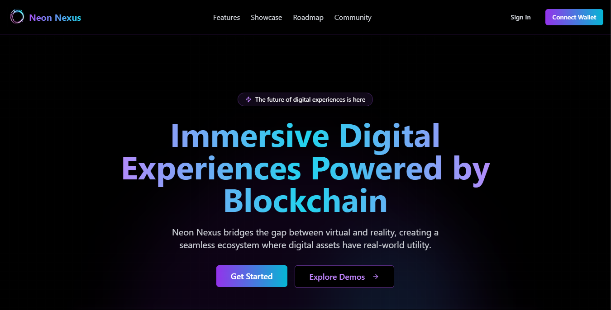

# 🚀 Neon Nexus Frontend



A modern, responsive frontend project showcasing a **futuristic blockchain platform** with **cyberpunk aesthetics**. This project demonstrates **advanced React techniques**, including animations, responsive design, and component reusability.

---

## 📌 Overview

This is a **frontend-only** demonstration project built with **React, TypeScript, and Tailwind CSS**. It features a **cyberpunk-themed UI** for a fictional blockchain platform called **Neon Nexus**.

### ✨ Features

- 🟣 **Cyberpunk-inspired UI/UX design**
- 📱 **Fully responsive layouts**
- 🎭 **Smooth page transitions and scroll animations**
- 🚀 **Framer Motion for advanced animations**
- 🧩 **Modular and reusable component architecture**
- 🌙 **Dark mode by default**
- 🎨 **Custom Tailwind theme with neon glow effects**

---

## 🛠️ Technologies Used

| Technology        | Description                     |
| ----------------- | ------------------------------- |
| **React 19**      | UI Library                      |
| **TypeScript**    | Strongly typed JavaScript       |
| **React Router**  | Client-side routing             |
| **Tailwind CSS**  | Utility-first styling           |
| **ShadCN/UI**     | Pre-built accessible components |
| **Framer Motion** | Advanced animations             |
| **Lucide React**  | Lightweight SVG icons           |

---

## ⚡ Getting Started

### ✅ Prerequisites

Ensure you have the following installed:

- [Node.js](https://nodejs.org/) **18.0.0 or later**
- **npm** or **yarn**

### 📥 Installation

1. Clone the repository:
   ```bash
   git clone https://github.com/allestercorton/neon-nexus.git
   cd neon-nexus
   ```
2. Install dependencies:
   ```bash
   npm install  # or yarn install
   ```
3. Run the development server:
   ```bash
   npm run dev  # or yarn dev
   ```
4. Open [http://localhost:5173](http://localhost:5173) in your browser to see the app in action! 🚀

---

## 🎭 Animations & UI Effects

- **Page Transitions**: Seamless navigation using **Framer Motion**.
- **Scroll Animations**: Elements fade in and move as users scroll.
- **Glowing Effects**: Cyberpunk-style neon glows using **Tailwind CSS**.
- **Dark Mode**: Enabled by default.

---

## 🤝 Contributing

Want to help improve Neon Nexus? Follow these steps:

1. **Fork** the repository
2. **Create a new branch**: `git checkout -b feature-name`
3. **Commit your changes**: `git commit -m "Add new feature"`
4. **Push to branch**: `git push origin feature-name`
5. Open a **Pull Request** 🚀

---

## 📜 License

This project is **MIT Licensed**. Created by **Allester Corton**. Feel free to modify and use it!

---

## 📧 Contact

For any questions or suggestions, reach out:

- Email: cortonallester@gmail.com
- Phone: +639513666254
